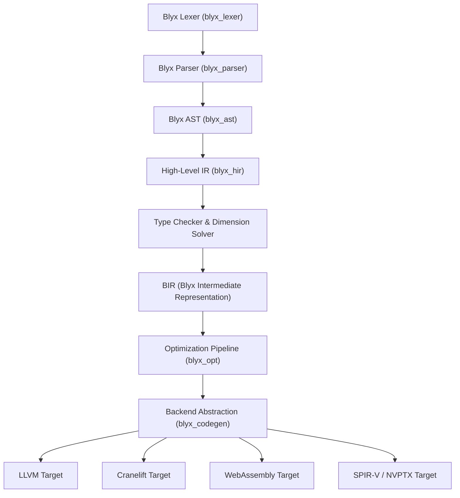

# Blyx V1 Independence Architecture Specification

This document presents the architectural decomposition and independence design for evolving **Blyx** into a fully independent programming language platform.

---

## 1. Subsystem Decomposition & Classification Matrix

| Subsystem | Classification | Migration Strategy & Rationale | Effort (Months) | Risk Level |
| :--- | :--- | :--- | :--- | :--- |
| **Lexer** | `REWRITE` | Migrate from `rustc_lexer` to native SIMD-accelerated Blyx lexer (`blyx_lexer`). | 2 | Low |
| **Parser** | `REWRITE` | Transition from Pratt recursive descent parser to unified Blyx PEG/LALR parser (`blyx_parser`). | 4 | Medium |
| **AST** | `REWRITE` | Replace Rust AST with typed Blyx Abstract Syntax Tree (`blyx_ast`). | 3 | Medium |
| **HIR** | `WRAP` -> `REWRITE` | Transition from `rustc_ast_lowering` to High-Level Blyx IR (`blyx_hir`). | 4 | Medium |
| **Borrow Checker** | `WRAP` | Retain lifetime and ownership safety rules while supporting actor memory isolation. | 6 | High |
| **Trait Solver** | `WRAP` | Retain trait resolution capabilities while extending support for tensor constraint solving. | 5 | High |
| **Type Checker** | `REWRITE` | Replace `rustc_hir_typeck` with unified Blyx type checker supporting static tensor dimension checking. | 6 | High |
| **MIR** | `RESERVE & REPLACE` | Supersede Rust MIR with **BIR (Blyx Intermediate Representation)**. | 8 | High |
| **LLVM Backend** | `WRAP` | Interface via clean backend abstraction layer (`blyx_codegen`). | 3 | Low |
| **Bootstrap** | `REWRITE` | Replace `x.py` / `bootstrap` with native `blyxpkg build` bootstrap target. | 3 | Low |
| **Package Manager** | `KEEP` | Native package manager (`blyxpkg`) built in Phase 5-6. | 0 | Low |
| **Standard Library** | `KEEP` | Native standard library (`blyx-std`) built in Phase 5-6. | 0 | Low |
| **Diagnostics** | `KEEP` | Native diagnostic engine in `blyxc`. | 0 | Low |
| **Language Server** | `KEEP` | Native stdio JSON-RPC LSP (`blyx-analyzer`) built in Phase 5-6. | 0 | Low |

---

## 2. Migration Dependency Graph



---

## 3. Blyx Intermediate Representation (BIR) Specification

### 3.1 SSA Representation & Control Flow
BIR operates in Static Single Assignment (SSA) form with basic blocks, explicit control flow edges, and strong static typing.

```
       ┌──────────────────────────────┐
       │   bb0 (Entry Block)          │
       │   %0 = alloc tensor<f32, 4, 4>│
       │   %1 = const_f32 1.0         │
       │   br bb1                     │
       └──────────────┬───────────────┘
                      │
                      ▼
       ┌──────────────────────────────┐
       │   bb1 (Compute Block)        │
       │   %2 = tensor_fill %0, %1    │
       │   gpu_dispatch %2, grid(4,4) │
       │   ret void                   │
       └──────────────────────────────┘
```

### 3.2 BIR Compute Instructions
- **`tensor_alloc(type, dims)`**: Allocates statically dimensioned tensor memory.
- **`tensor_matmul(t1, t2)`**: Vectorized matrix multiplication operation.
- **`gpu_dispatch(kernel_fn, args, grid)`**: Dispatches compute kernel to heterogeneous accelerator devices.
- **`actor_send(actor_ref, msg)`**: Asynchronous lock-free message send.
- **`parallel_for(range, closure)`**: Dispatches parallel iteration tasks across thread pools.

---

## 4. Blyx Runtime ABI Specification

1. **Calling Convention**: System V AMD64 ABI on POSIX; Microsoft x64 calling convention on Windows.
2. **Stack Model**: Dynamic split-stack support with 16-byte stack alignment.
3. **Panic Model**: Zero-cost DWARF unwind tables (`-C panic=unwind`) or abort on panic (`-C panic=abort`).
4. **Actor Runtime ABI**: Mailboxes backed by lock-free MPSC ring buffers managed by `blyx`.
5. **GPU Dispatch ABI**: Host runtime wrapper interfacing with Vulkan/SPIR-V and CUDA/NVPTX drivers.

---

## 5. Compiler Plugin & Backend Abstraction Interface

```rust
pub trait BlyxBackend {
    fn name(&self) -> &'static str;
    fn compile_bir_module(&self, module: &BirModule) -> Result<CompiledArtifact, String>;
}

pub trait BlyxOptPass {
    fn name(&self) -> &'static str;
    fn run_pass(&mut self, module: &mut BirModule);
}
```

Support targets: **LLVM**, **Cranelift**, **GCC**, **WebAssembly**, **ARM**, **RISC-V**, and future **NCC**.
